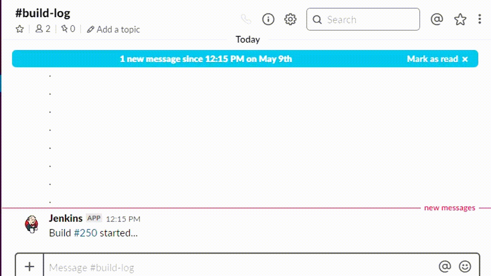

# Jenkins Library
Instructions for setting up this Jenkins pipeline library which will query GitHub for the corresponding commit payload, save the commit author as an environment variable which is then used in the Slack notifier which posts messages as a bot user to your build-log slack channel.

Table of contents
=================

* [Demo](#demo)
* [Required Jenkins plugins](#required-jenkins-plugins)
* [Quick start](#quick-start)

## Demo

<kbd></kbd>

## Required Jenkins plugins

  - Pipeline: GitHub Groovy Libraries 1.0
  - HTTP Request Plugin 1.8.22

## Quick start

These instructions are intended to assist in setting up this Jenkins pipeline library.
1. Create a Jenkins credential (type: secret text) which contains a [GitHub PAT](https://help.github.com/en/articles/creating-a-personal-access-token-for-the-command-line)

2. Create a [Slack app](https://api.slack.com/apps)
    - Create a bot user
    - Create a Jenkins credential (type: secret text)
        - **ID**: slack-token
        - **Secret**: Bot User OAuth Access Token from the Slack app you created

3. Fork this repo to your own GitHub account or GitHub organization
    - Update all of the configuration properties in [Config.groovy](./src/components/Config.groovy)
        - For **GITHUB_TOKEN_CRED_ID** you will need to _use the credential id you made in step 1_

4. Configure Jenkins
    - In Jenkins instance, navigate to Manage Jenkins > Configure System and scroll down to the *Global Pipeline Libraries* section
    - Key Configuration settings
        - **Default version:** master
        - **Load implicitly:** False
        - **Allow default version to be overridden:** True
        - **Include @Library changes in job recent changes:** True
        - **Retrieval method:** Modern SCM
        - **Source Code Management:** GitHub
        - **Credentials:** _Use the credential id you made in step 1_
        - **Owner:** coltenkrauter (typically this is your orginazation or username)
        - **Repository:** jenkins-library
        - **Behaviors:** Discover branches, all branches
    - Of course, save the changes

5. Import the library into groovy files
    - Add this to the top of files your Jenkinsfile
        ```
        #!/usr/bin/env groovy
        @Library("jenkins-library@master")

        import hudson.model.*;

        env.BUILD_START = new Date();
        env.SUCCESS = "true";
        ```

Checkout [Jenkinsfile](./Jenkinsfile) for a usage example.
